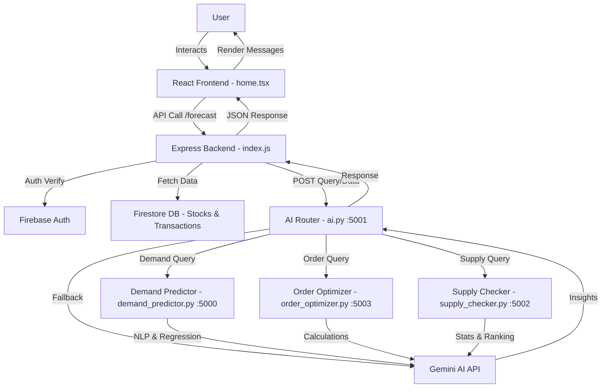

This is a [Next.js](https://nextjs.org) project bootstrapped with [`create-next-app`](https://nextjs.org/docs/app/api-reference/cli/create-next-app).

## Getting Started

First, run the development server:

```bash
npm run dev
# or
yarn dev
# or
pnpm dev
# or
bun dev
```

Open [http://localhost:3000](http://localhost:3000) with your browser to see the result.

You can start editing the page by modifying `app/page.tsx`. The page auto-updates as you edit the file.

This project uses [`next/font`](https://nextjs.org/docs/app/building-your-application/optimizing/fonts) to automatically optimize and load [Geist](https://vercel.com/font), a new font family for Vercel.

## Learn More

To learn more about Next.js, take a look at the following resources:

- [Next.js Documentation](https://nextjs.org/docs) - learn about Next.js features and API.
- [Learn Next.js](https://nextjs.org/learn) - an interactive Next.js tutorial.

You can check out [the Next.js GitHub repository](https://github.com/vercel/next.js) - your feedback and contributions are welcome!

## Deploy on Vercel

The easiest way to deploy your Next.js app is to use the [Vercel Platform](https://vercel.com/new?utm_medium=default-template&filter=next.js&utm_source=create-next-app&utm_campaign=create-next-app-readme) from the creators of Next.js.

Check out our [Next.js deployment documentation](https://nextjs.org/docs/app/building-your-application/deploying) for more details.


# Nexabiz AI

Nexabiz AI is an intelligent inventory management system that leverages AI for **demand forecasting**, **order optimization**, and **supplier analysis**. It features a **React frontend**, **Node.js/Express backend**, and **Python AI agents**, integrated with **Firebase** for authentication and storage, and **Google Gemini AI** for natural language recommendations.

---

## 🚀 Features

- 📊 **User Dashboard** — Interactive analytics, profile management, and AI chat.
- 🤖 **AI-Powered Queries** — Ask in natural language about demand, orders, or suppliers.
- 📈 **Demand Forecasting** — Predict future product requirements.
- 📦 **Order Optimization** — Generate optimal reorder quantities.
- 🏷 **Supplier Analysis** — Rank suppliers by consistency, price, and delivery trends.
- 🔐 **Secure Authentication** — Firebase-based login with role handling.
- ⚡ **Real-Time AI Chat** — Typing indicators and history persistence.

---

## 🧠 System Architecture

Nexabiz AI follows a modular service-oriented architecture with:

- **Frontend Client (React)**
- **Backend API (Express + Firebase)**
- **AI Router (Flask)**
- **Specialized Python Agents**

---

### 📌 High-Level Architecture Diagram



---

## 🧩 Component Breakdown

| Component | Technology | Purpose |
|-----------|------------|---------|
| Frontend | React + Tailwind + Framer Motion | User Interface & Chat |
| Backend API | Node.js + Express | Authentication & Firestore Bridge |
| AI Router | Flask | Query Routing & NLP Handling |
| AI Agents | Python (spaCy, scikit-learn, RapidFuzz) | Forecasting / Optimization / Supply Insight |
| External | Firebase + Gemini AI | Storage & NLP Fallback |

---

## 🛠 Installation

### ✅ Prerequisites

- Node.js **v18+**
- Python **v3.10+**
- Firebase Project
- Gemini API Key

---

### 1️⃣ Clone the Repository

```bash
git clone https://github.com/yourusername/nexabiz-ai.git
cd nexabiz-ai
```

---

### 2️⃣ Frontend Setup

```bash
cd frontend
npm install
npm run dev
```

Update **/lib/firebase.ts** with your Firebase config.

---

### 3️⃣ Backend Setup

```bash
cd backend
npm install
```

Create `.env`:

```
PORT=3001
```

Run:

```bash
node index.js
```

---

### 4️⃣ AI Agents Setup

```bash
cd ai
pip install flask flask-cors requests python-dotenv google-generativeai spacy scikit-learn pandas numpy rapidfuzz tenacity
python -m spacy download en_core_web_sm
```

Create `.env`:

```
GEMINI_API_KEY=your_key_here
```

Run each agent:

```bash
python ai.py            # Port 5001
python demand_predictor.py  # Port 5000
python order_optimizer.py   # Port 5003
python supply_checker.py    # Port 5002
```

---

### 5️⃣ Firebase Setup

- Enable **Email/Password Authentication**
- Create Firestore collections:

```
users/{userId}/stocks
users/{userId}/transactions
```

- Place `serviceAccountKey.json` in `/backend` and `/ai`

---

## 🧪 Example AI Queries

| Query | Expected AI Response |
|--------|--------------------|
| *Predict demand for Coffee next month* | "You have 50 in stock, sold 30 last month. Forecast: 35 units required." |
| *Optimize order for Tea* | "Current stock 20, avg sales 15. Suggested reorder: 0 units." |
| *Supply check for Sugar* | "Best supplier: Pure Mills — Avg Price $5, Delivered 100 units." |

---

## 🤝 Contributing

```bash
git checkout -b feature/YourFeature
git commit -m "Add YourFeature"
git push origin feature/YourFeature
```

Open a **Pull Request** 🚀

---

## 📄 License

MIT License — feel free to use & extend.

