# 🧠 NexaBiz AI – Intelligent Inventory Forecasting System

> Smart, predictive, and autonomous inventory management powered by AI agents — designed for modern manufacturing businesses.

[](https://choosealicense.com/licenses/mit/)
[](https://www.python.org/downloads/)
[](https://nextjs.org/)

---

## 🧩 Project Overview

**NexaBiz AI** is an end-to-end AI-driven inventory forecasting and automation system developed for the clothing manufacturing sector. The platform intelligently predicts demand, manages supply, automates email responses, and optimizes stock control — all integrated within a seamless, user-friendly dashboard.

---

## ⚙️ Core Features

| Agent | Description |
|-------|-------------|
| 🧮 **Demand Predictor (ForecastX)** | Predicts future demand using LightGBM, trained on 4 years of sales data, weather patterns, holidays, and price trends. |
| 💬 **SmartMail Agent (AutoNex)** | AI-powered NLP engine that reads customer emails, identifies intent (e.g., inquiries or orders), checks stock, and composes professional replies. |
| 🧵 **Supply Checker (ReStock AI)** | Monitors stock levels vs predicted demand and automatically generates supplier emails when fabric or material levels are low. |

---

## 🏗️ System Architecture

```mermaid
flowchart TD
    A[Customer Email 📩] -->|via Gmail API| B[SmartMail Agent 🤖]
    B -->|Extract Order Details| D[Inventory Database 🏪]
    D -->|Stock Status| B
    B -->|Order Confirmation / Out of Stock| A

    D -->|Historical Data| C[Demand Predictor 🧮]
    E[Weather API ☀️] --> C
    F[Holiday Dataset 📅] --> C
    G[Google Trends API 📈] --> C
    C -->|Next Month Forecast| H[Supply Checker 🧵]
    H -->|Check Fabric Stock| D
    H -->|Generate Supplier Email| I[Supplier 📦]

    subgraph Backend
    B
    C
    H
    D
    end

    subgraph Frontend
    J[Next.js Dashboard 💻]
    end

    D --> J
    C --> J
    H --> J
```



---

## 🧠 Machine Learning Overview

| Feature | Description |
|---------|-------------|
| **Model** | LightGBM Regressor |
| **Training Data** | 4 years of fictionalized sales data |
| **Input Features** | Product name, base/selling price, past 3-month sales, weather, holidays, popularity |
| **Output** | Forecasted demand for the next month |
| **Performance Metrics** | RMSE, MAPE, R² Score |
| **Tools** | Python, Pandas, NumPy, Scikit-Learn, LightGBM |

---

## 🧩 Responsible AI Practices

We prioritize transparency, fairness, and explainability throughout the model lifecycle:

- ✅ **Explainability** — SHAP values visualize feature importance in demand prediction
- ⚖️ **Fairness** — Ensures no bias across product categories or pricing tiers
- 🔐 **Privacy** — OAuth2-secured Gmail integration; no customer data stored in raw form
- 📘 **Transparency** — Each prediction and automated email is logged for auditability

---

## 🧰 Tech Stack

| Layer | Tools |
|-------|-------|
| **Frontend** | Next.js, TailwindCSS, Framer Motion, React Query |
| **Backend** | Node.js (Express), Flask (Python) |
| **Database** | Firebase Firestore |
| **Machine Learning** | Python, LightGBM, Pandas, NumPy |
| **Email Integration** | Gmail API (OAuth 2.0, SMTP) |
| **AI Agents** | Google Gemini 2.0 Flash API, Regex-based NLP extraction |
| **Deployment** | Vercel (Frontend) + Render / AWS (Backend) |

---

## 🧭 Setup Guide

### 1️⃣ Clone Repository

```bash
git clone https://github.com/your-username/nexabiz-ai.git
cd nexabiz-ai
```

### 2️⃣ Environment Variables

Create `.env` files for backend and frontend:

**Frontend (`.env.local`)**

```env
NEXT_PUBLIC_FIREBASE_API_KEY=your_key
NEXT_PUBLIC_BACKEND_URL=http://localhost:3001
```

**Backend (`.env`)**

```env
GEMINI_API_KEY=your_gemini_key
GMAIL_CLIENT_ID=your_client_id
GMAIL_CLIENT_SECRET=your_client_secret
```

### 3️⃣ Install Dependencies

```bash
# Frontend
cd nexabiz-pos && npm install

# Backend
cd backend && pip install -r requirements.txt
```

### 4️⃣ Run the App

```bash
# Backend (Flask + Node)
node index.js
python auto_reply_agent.py

# Frontend
npm run dev
```

---

## 📊 Sample Forecast Report

| Product | Forecast (Next Month) | Current Stock | Reorder Suggestion |
|---------|----------------------|---------------|-------------------|
| Moose | 145 units | 55 units | Reorder 90 units |
| SCY Air Drift Tee | 210 units | 190 units | Reorder 20 units |

---

## 💬 Example AI Email Flow

**Customer Email:**

> "Hi, I'd like to order 10 Moose tees and 17 SCY Air Drift Tees. Do you have them in stock?"

**AI Reply (AutoNex):**

```html
Dear Kavindya,

Thank you for your order! We currently have 55 Moose tees and 190 SCY Air Drift Tees available.

Your order of 10 Moose tees and 17 SCY Air Drift Tees has been successfully placed.

We'll notify you once your shipment is ready.

Best regards,
The Nexabiz Team
```

---

## 🧵 Supply Checker Example

**Input:**
- Predicted demand for Moose = 145 units
- Fabric required per unit = 1.3 meters
- Current fabric stock = 120 meters

**Output (Generated Email):**

```html
Dear Supplier,

We're forecasting a demand of 145 Moose tees for next month. Based on current stock levels, we'll require an additional 68.5 meters of cotton fabric.

Please confirm availability at your earliest convenience.

Best regards,
Nexabiz Procurement Team
```

---

## 📈 Evaluation

| Metric | Value |
|--------|-------|
| **RMSE** | 8.52 |
| **MAPE** | 6.7% |
| **R² Score** | 0.94 |
| **Avg. Response Time** | 1.2s (AI Reply) |
| **Accuracy of Order Detection** | 97.3% |

---

## 💸 Commercialization Plan

| Aspect | Description |
|--------|-------------|
| **Target Users** | Small-to-mid clothing manufacturers |
| **Pricing Model** | SaaS — Tiered (Basic, Pro, Enterprise) |
| **Core Value** | Reduces inventory waste, automates communication, predicts stock needs |
| **Marketing** | B2B outreach, LinkedIn campaigns, partnerships with fabric suppliers |
| **Scalability** | Extendable to other manufacturing sectors (e.g., footwear, accessories) |

---

## 📁 Repository Structure

```
nexabiz-ai/
│
├── backend/
│   ├── index.js
│   ├── auto_reply_agent.py
│   ├── gmailOAuth.json
│   └── token.json
│
├── nexabiz-pos/
│   ├── app/
│   ├── components/
│   ├── lib/
│   └── pages/
│
├── dataset/
│   └── sales_4years.csv
│
├── README.md
└── .env
```

---

## 📸 UI Preview

| Dashboard | Forecast | Inbox |
|-----------|----------|-------|
|  |  |  |

*Replace placeholder images with actual screenshots*

---

## 🤝 Contributors

| Name | Role |
|------|------|
| **Dinura Sanmith** | Fullstack & AI Engineer |
| **Kavindya HVS** | ML Research & Data Engineering |
| **Team Nexabiz** | UI/UX & Integration |

---

## 📜 License

This project is licensed under the MIT License — free for personal and commercial use.

See [LICENSE](LICENSE) file for details.

---

## 🌟 Star This Repository

If you find this project useful, please consider giving it a ⭐ on GitHub!

---

## 📧 Contact

For questions or collaboration opportunities, reach out to us at:
- **Email**: contact@nexabiz.ai
- **LinkedIn**: [NexaBiz AI](https://linkedin.com/company/nexabiz)

---

<div align="center">
  <strong>Built with ❤️ by Team Nexabiz</strong>
</div>
